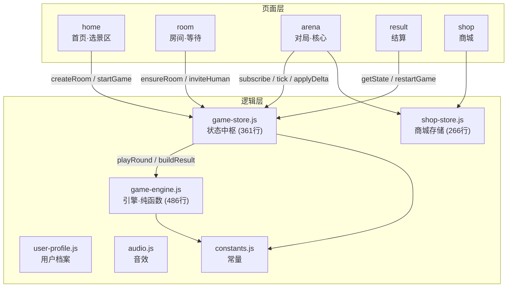
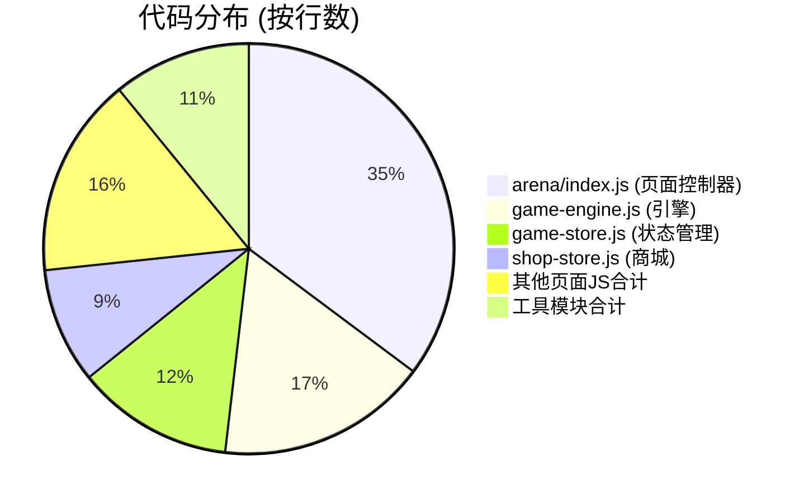

# 游戏逻辑全面审查报告

## 一、当前架构总览



---

## 二、核心问题清单

### 🔴 P0 · 严重问题

#### 1. Arena 页面过度膨胀 — 1028 行 "上帝页面"

[arena/index.js](file:///Users/hh/Desktop/game_codex/pages/arena/index.js) 承担了远超页面控制器应有的职责：

| 混入的职责 | 行数 | 应在的位置 |
|-----------|------|-----------|
| 棋盘布局计算 (`BOARD_LAYOUT`, `buildBoardPlayers`) | ~75行 | `utils/board-layout.js` |
| 组队连线逻辑 (`buildTeamLinks`, `mergeTeamLinks`, `dissolveCurrentTeam`) | ~120行 | `utils/team-link.js` |
| 投资/福袋系统 (`INVESTMENT_POOL`, `buildOpportunity`, `settlePosition`, `onConfirmOpportunity`, `onSellPosition`) | ~130行 | `utils/investment.js` |
| 表情互动系统 (`emoteMap`, `setPlayerEmote`, `scheduleRemoteEmote`) | ~80行 | `utils/emote.js` |
| 分数可见性逻辑 (`refreshVisibleScores`, `visibleScoreIdSet`) | ~30行 | `game-engine.js` |

> **风险**: 任何人修改福袋逻辑时会影响表情系统的代码视野，容易引入回归 bug。

---

#### 2. 全量纯前端模拟 — 无真实多人交互

当前所有"对手"行为都是本地 `Math.random()` 驱动的假数据：

- [game-engine.js L341-366](file:///Users/hh/Desktop/game_codex/utils/game-engine.js#L341-L366) `createScoreDelta()` — 每轮分数变动纯随机
- [arena/index.js L591-611](file:///Users/hh/Desktop/game_codex/pages/arena/index.js#L591-L611) `scheduleRemoteEmote()` — 随机让机器人"发表情"
- 组队成功后 **700ms 写死成功**，无真实握手

> **现状**: 这是一个单机模拟器，不是多人游戏。这可能是有意的 MVP 设计，但需要明确标注。

---

#### 3. 金币经济系统断裂

两套金币数值毫无关联：

| 系统 | 数值来源 | 位置 |
|------|---------|------|
| **商城** `coins: 8820` | 硬编码默认值 | [shop-store.js L4](file:///Users/hh/Desktop/game_codex/utils/shop-store.js#L4) |
| **结算** `coins: gain * 3` | 对局收益 × 3 | [game-store.js L102](file:///Users/hh/Desktop/game_codex/utils/game-store.js#L102) |

结算页面计算出了金币奖励，但 **从不写入 shop-store**。玩家看到"获得 450 金币"只是展示，余额永远不变。

---

#### 4. 投资系统经济平衡有缺陷

[arena/index.js L285-330](file:///Users/hh/Desktop/game_codex/pages/arena/index.js#L285-L330) 的投资系统：

```
高风险: 倍率 0.42 ~ 1.95 → 期望 ≈ 1.185 (正收益)
中风险: 倍率 0.66 ~ 1.58 → 期望 ≈ 1.12  (正收益)
低风险: 倍率 0.84 ~ 1.33 → 期望 ≈ 1.085 (正收益)
```

**所有风险等级的数学期望都是正的**，而且高风险期望最高。这意味着：
- 理性玩家应该**每次都选高风险**，没有策略博弈空间
- 加上 `holdBonus` 持有加成，长期持有必赢
- 投资永远优于不投资 → 系统没有真正的"风险"

---

### 🟡 P1 · 结构性问题

#### 5. Result 页分数明细是伪造数据

[result/index.js L136-156](file:///Users/hh/Desktop/game_codex/pages/result/index.js#L136-L156):

```javascript
// Mock score breakdown based on total score
baseScore = Math.floor(total * 0.45);
achievementBonus = Math.floor(total * 0.25);
teamBonus = total - baseScore - achievementBonus;
penalty = Math.floor(total * Math.random() * 0.05);
baseScore += penalty; // 强行凑数让总分正确
```

这些"维度分数"完全是从总分按比例拆出来的假数据，不是真实的游戏行为追踪结果。

---

#### 6. 页面生命周期不严谨

| 问题 | 文件 | 行号 |
|------|------|------|
| Home 点"游玩"时 `createRoom` + `startGame` 两步连调，跳过 Room 页 | [home/index.js L48-53](file:///Users/hh/Desktop/game_codex/pages/home/index.js#L48-L53) |
| Arena `ensureArenaState()` 在 `status === 'idle'` 时会 `createRoom` + `startGame`，直接跳过等待 | [arena/index.js L442-459](file:///Users/hh/Desktop/game_codex/pages/arena/index.js#L442-L459) |
| Room 页不监听 store 变化，状态不主动同步 | [room/index.js](file:///Users/hh/Desktop/game_codex/pages/room/index.js) |
| Result `onShow` 反复触发 `playResultFirework()`，每 1.8s 播一次音效持续 8s | [result/index.js L74-83](file:///Users/hh/Desktop/game_codex/pages/result/index.js#L74-L83) |

---

#### 7. 音频资源泄漏

[audio.js L39-63](file:///Users/hh/Desktop/game_codex/utils/audio.js#L39-L63): 每次 `playCue()` 都 `createInnerAudioContext()`，高频场景（每轮 tick、表情发送）会产生大量 audio 实例。微信小程序对 audio context 数量有限制（通常 10 个），超出会静默失败。

---

#### 8. tabs 导航数据重复定义 4 次

同样的 `tabs` 数组在 4 个页面（home、arena、result、room的WXML中也有硬编码导航）各写了一份，无法统一维护。

---

## 三、架构现状评估



> **核心矛盾**: arena 页面的代码量比底层引擎还大，它既是"View Controller"又是"Feature Server"。

---

## 四、改进规划

### Phase 1: 拆分 Arena · 解耦关注点
> 预计工作量: 中等 | 风险: 低

```
utils/
├── board-layout.js     ← 从 arena 抽出: BOARD_LAYOUT, buildBoardPlayers, getNodeCenter
├── team-link.js        ← 从 arena 抽出: buildTeamLinks, mergeTeamLinks, findSelfTeamInfo
├── investment.js       ← 从 arena 抽出: INVESTMENT_POOL, buildOpportunity, settlePosition
├── emote.js            ← 从 arena 抽出: emoteMap 管理, scheduleRemoteEmote
└── (已有模块不变)
```

**目标**: arena/index.js 从 1028 行降到 ~400 行，只做页面生命周期 + 事件分发。

---

### Phase 2: 修复金币经济闭环
> 预计工作量: 小 | 风险: 低

```diff
 // game-store.js → finishGame()
 function buildFinishedResult(currentState) {
   const result = ...;
+  // 将金币奖励写入 shop-store
+  if (result.coins > 0) {
+    shopStore.addCoins(result.coins);
+  }
   return result;
 }
```

同时在 `shop-store.js` 添加 `addCoins(amount)` 方法。这样玩完一局真正能赚金币去商城消费。

---

### Phase 3: 投资系统平衡性修正
> 预计工作量: 小 | 风险: 低

将倍率范围调整为**期望值 ≤ 1.0**（高风险高方差但不保赚）：

```javascript
const rangeMap = {
  high: { min: 0.15, max: 2.2 },  // 期望 ≈ 1.175 → 0.95 (略亏)
  mid:  { min: 0.50, max: 1.45 }, // 期望 ≈ 0.975
  low:  { min: 0.75, max: 1.15 }, // 期望 ≈ 0.95
};
```

并加入"持有时间越长波动越大"的机制，替代当前的纯加成。

---

### Phase 4: 真实分数追踪（告别伪造数据）
> 预计工作量: 中等 | 风险: 中

在 `game-store.js` 的 state 中新增 `scoreLog`，每次分数变动时记录来源：

```javascript
state.scoreLog[playerId].push({
  type: 'round' | 'team_bonus' | 'investment' | 'fortune_bag',
  delta: Number,
  round: Number,
  timestamp: Number,
});
```

结算时从 `scoreLog` 真实聚合出维度分数，替代 result 页的 mock 拆分。

---

### Phase 5: 补全房间页流程
> 预计工作量: 中等 | 风险: 中

- Room 页添加 `gameStore.subscribe()` 监听，玩家加入/离开时实时更新
- 移除 Home → Arena 的"跳过房间"捷径（或标注为"快速匹配"模式）
- Room 页增加"准备/取消准备"状态切换
- 添加倒计时启动（目前 `start()` 是瞬间跳转）

---

### Phase 6: 音频池化 + tabs 去重
> 预计工作量: 小 | 风险: 极低

```javascript
// audio.js — 复用 audio context
const pool = {};
function playCue(name, options = {}) {
  if (pool[name]) { pool[name].stop(); pool[name].seek(0); }
  else { pool[name] = wx.createInnerAudioContext(); }
  pool[name].src = SOURCES[name];
  pool[name].volume = options.volume || 1;
  pool[name].play();
}
```

tabs 配置抽到 `constants.js` 统一导出。

---

## 五、优先级推荐

| 顺序 | 阶段 | 理由 |
|------|------|------|
| ① | Phase 2 (金币闭环) | 修一行代码，立刻让经济系统跑通 |
| ② | Phase 3 (投资平衡) | 调几个数值，游戏可玩性显著提升 |
| ③ | Phase 1 (拆分 Arena) | 为后续所有迭代降低维护成本 |
| ④ | Phase 4 (分数追踪) | 让结算数据有意义 |
| ⑤ | Phase 6 (音频 + tabs) | 小优化收尾 |
| ⑥ | Phase 5 (房间流程) | 偏体验优化，优先级灵活 |

---

## 六、总结

> [!IMPORTANT]
> 整体代码质量不错 — 函数命名清晰、纯函数封装到位、store 的 subscribe 模式也很规范。**不是"混乱"，而是"膨胀"** — arena 页面把太多功能逻辑吸收到了自己身上，金币经济没有闭环，投资系统数值缺少平衡。

这些都是 MVP 快速推进过程中的常见债务，按上面的优先级逐步修复即可。

你觉得从哪个阶段开始？或者有哪些方向你想优先推进？
